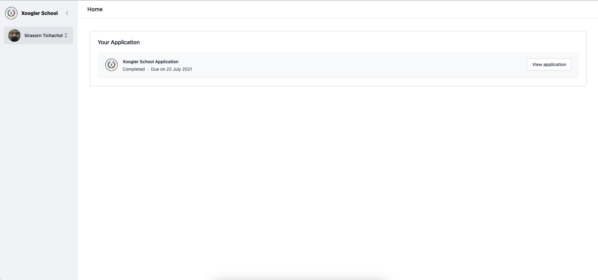

# XSO Applications


Admin Overview



Student View Home Page

## Introduction

XSO Applications is a project to ease the flow for future Xoogler School applications. By creating a one-stop platform for all applications, admins can prevent the loss of data and screen through applications easily. As a result, [Xoogler.co](http://xoogler.co) should be able to scale the number of applications significantly in future cohorts.

Link: [https://xso-app.vercel.app/](https://xso-app.vercel.app/)

Duration of project: 28 Jan 2020 - Present

Tech Stack: React.js, Next.js, Tailwind CSS, Firebase Cloud Storage, MongoDB, Vercel, NextAuthJS

## Install

1. After cloning the repo, run 

```bash
yarn install
```

2. Make sure that your environment variables are installed by placing them into .env.local. You can get them from the product manager.

3. Once all is done, run

```bash
yarn dev
```

## API

- Admin
    - '/'
        - GET: Download all applications data as csv
    - '/app'
        - GET: Get all applications
    - '/app/:id/index'
        - GET: Get a specific application
        - DELETE: Delete a specific application
    - '/app/:id/accept'
        - PUT: Accept an application
    - '/app/:id/reject'
        - PUT: Reject an application
- App
    - '/'
        - GET: View completed application if user is logged in and has applied
        - POST: Submit new application
- Auth
    - '/[...nextauth]'
- User
    - '/'
        - GET: Get current user
- Tester
    - '/'
        - GET: Generate 100 fake applications

## Contributors:

v1 (28 Jan 2020 - Present):

- [Sirasorn Tichachol](https://github.com/SirasornT)
- [Jason Beh](https://github.com/behjieshen)
- [Lucas Soeth](https://github.com/lucasoeth)